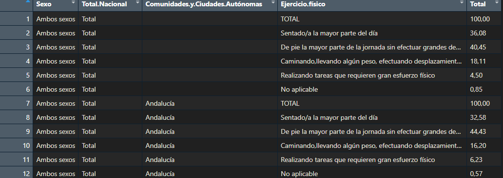
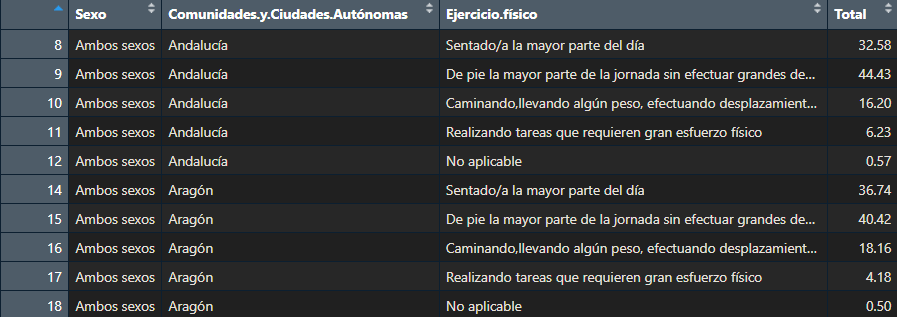

Este breve documento comentará los contenidos del documento Funciones.R que contiene las funciones usadas para la realización de este seminario.

## Vectores prefuncion

Para el correcto funcionamiento de las funciones se han de definir previamente varios vectores que contienen datos que se utilizaran posteriormente, estos son:

-   comunidades_autónomas: contiene los nombres de las comunidades autónomas tal y como vienen en los datasets.

-   sexos: contiene los niveles de la columna de sexos

```{r, eval = F}
#------------ VECTORES PARA EL TRATAMIENTO DE DATOS
comunidades_autonomas = c("Andalucía", "Aragón", "Asturias (Principado de)",
                          "Balears (Illes)", "Canarias", "Cantabria",
                          "Castilla y León", "Castilla-La Mancha", "Cataluña",
                          "Comunitat Valenciana", "Extremadura", "Galicia",
                          "Madrid (Comunidad de)", "Murcia (Región de)", "Navarra (Comunidad Foral de)",
                          "País Vasco", "Rioja (La)", "Ceuta (Ciudad Autónoma de)", "Melilla (Ciudad Autónoma de)")
sexos = c("Mujeres","Hombres", "Ambos sexos")
```

## TratamientoGeneralDatos()

Esta función tiene como objetivo modificar y tratar los datasets que se quieran utilizar en el seminario, su implementación tiene como objetivo tratar los datasets provenientes de la encuesta general de salud del INE, en específico aquellos que agrupan los datos en función del sexo y la comunidad autónoma.

El tratamiento que se les aplica será necesario para su posterior análisis en el visor de datos.

Primeramente se han de comentar los parámetros que la función contiene, siendo estos:

-   data : dataset que se quiere tratar

-   comunidades_autonomas: vector predefinido en la introducción (comunidades_autónomas)

-   levels_sexos: vector predefinido en la introducción (sexos)

```{r, eval = F}
#Trata los datos que se encuntran en las tablas, está hecho para el formato
#de datos entragado por el INE en las tablas donde las categorias son sexo y Comiunidad autónoma
TratamientoDatosGeneral <- function(data, comunidades_autonomas = comunidades_autonomas,
                                    levels_sexos = sexos){
  #
  # CUERPO DE LA FUNCIÓN
  #
}
```

La implementación de la función es relativamente sencilla, primero se crea un filtro (un vector de valores lógicos) que mantendrá todas las filas menos las que indican el total de cada comunidad (siempre es un 100%) y las que no tienen comunidad autónoma, no queremos estas filas ya que no aportan ningún valor a los datos. Después de aplicar el filtro se le indica a R que las columnas de sexo y comunidad autónoma son categorías con niveles, para esto se utiliza la función `factor()`. Por último se elimina la columna Total.Nacional que solo contiene el valor "total".

Para asignar los niveles a la variable categórica que este midiendo el dataset hemos de saber primero cuantos niveles tiene esta variable, para ello, a traves de la experimentación se relaciona un número concreto de filas que ha de tener el dataset con el número de niveles que tiene su variable categórica, en este caso; 114 filas son 2 niveles, 171 filas son 3 niveles, 228 filas son 4 niveles y 285 filas son 5 niveles. Luego de saber el número de niveles de la variable se toma como parámetro `levels` en la función `factor()` un vector formado por las primeras n filas de la columna (siendo n el número de niveles)

Para terminar se cambia el tipo de variable de la columna Total de character a numeric para su correcta interpretación. Para hacerlo, se sustituye la "," por el "." con la función `gsub()` y luego se aplica a toda la columna la función `as.numeric()`.

Luego se devuelve el dataset tratado

```{r, eval=FALSE}
#Trata los datos que se encuntran en las tablas, está hecho para el formato
#de datos entragado por el INE en las tablas donde las categorias son sexo y Comiunidad autónoma
TratamientoDatosGeneral <- function(data, comunidades_autonomas = comunidades_autonomas,
                                    levels_sexos = sexos){
  #Aplica un filtro y quita las columnas que no queremos
  filtro <- (data[,4] != "TOTAL" & data[,4] != "Total") & data$Comunidades.y.Ciudades.Autónomas != ""
  data <- data[filtro,]
  #Asigna a cada columna sus factores y elimina las que no queremos
  data$Sexo <- factor(x = data$Sexo, levels = levels_sexos)
  data$Comunidades.y.Ciudades.Autónomas <- factor(x = data$Comunidades.y.Ciudades.Autónomas,
                                                  levels = comunidades_autonomas)
  data$Total.Nacional <- NULL
  #Esta linea opera en la columna 3, donde siempre estaran las categorias de la respuesta
  #En funcion de la longitud del vector se infiere cuantas categorisa de respuesta existen
  if(length(data[,3])  == 114) {
    data[,3] <- factor(x = data[,3], levels = c(data[1,3],data[2,3]))
  } else if(length(data[,3]) == 171) {
    data[,3] <- factor(x = data[,3], levels = c(data[1,3],data[2,3], data[3,3]))
  } else if(length(data[,3]) == 228){
    data[,3] <- factor(x = data[,3], levels = c(data[1,3],data[2,3],data[3,3], data[4,3]))
  } else if(length(data[,3])  == 285) {
    data[,3] <- factor(x = data[,3], levels = c(data[1,3],data[2,3],data[3,3], data[4,3], data[5,3]))
  } 
  
  
  #Pasa el totla de character a numeric
  data$Total = as.numeric(gsub(",",".", data$Total))
  return(data)
}

```

Se observará el efecto de la función en un ejemplo

### DATASET ORIGINAL



### DATASET TRATADO


