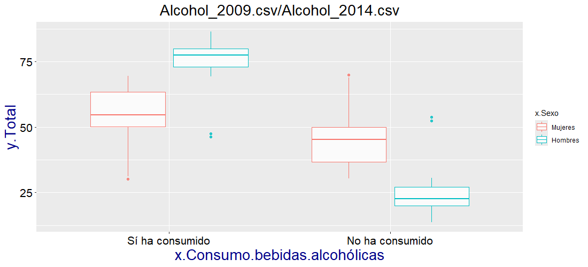
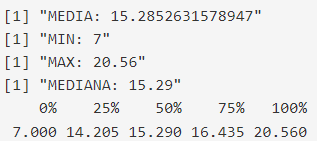

```{r setup, include=FALSE}
knitr::opts_chunk$set(echo = TRUE)
```

## Introducción

ESTE ARCHIVO Y TODO EL TRABAJO SE ENCUENTRA EN EL GITHUB([AQUI](https://github.com/vicBrownS/Seminario_Fuentes_Victor_Nicolas_Sara.git))

Como se indica en el archivo README el objetivo de este trabajo es el análisis de la evolución y correlación entre ciertos determinantes de salud y el estado general de salud de la población española.

Los datos utilizados provienen de la encuesta europea de salud que el INE ha realizado en los años 2009, 2014 y 2020. Para acceder a los datos se utiliza el portal web del INE ([AQUI](https://www.ine.es/dyngs/INEbase/operacion.htm?c=Estadistica_C&cid=1254736176784&menu=resultados&idp=1254735573175)).

#TODO PONER REFERENCIAS

## Criterios y consideraciones sobre los datos

Los criterios utilizados para fitrar la enorme cantidad de datos proveniente de esta encuesta son los siguientes:

-   Los datos a tratar han de tener su resultado en cifras relativas, es decir, tienen que estar expresados en porcentajes.

-   Los datos a tratar han de estar agrupados en función del sexo y de la comunidad autónoma.

-   Los datos a tratar tienen que posibilitar un seguimiento de su evolución, es decir, tiene que aparecer una encuesta con las mismas categorías a través de los tres años que se estudian (2009, 2014, 2020).

Estos criterios permiten una unicidad en los datos que facilita su tratamiento y correlación.

Importante denotar las siguientes apreciaciones sobre los datasets utilizados:

-   Todos los datos trabajan sobre una muestra poblacional de 35.000 personas de distintas comunidades autónomas.

-   Todos los datasets están organizados en función de variables categóricas **(e.j sí ha fumado, no ha fumado)**, resaltar la inherente incapacidad de estos datos de representar con exactitud los sentimientos o situación del encuestado resultando en un riesgo de error y de sesgo creados por la forma de presentar el estudio.

-   Todos los datos están sujetos a errores de muestreo y poseen sus coeficientes de variación correspondientes, por simplificar y facilitar la realización de este trabajo no se toman en cuenta estos coeficientes para el análisis estadístico. Se recomienda discreción en la consideración de la veracidad de los datos y resultados.

## Datos utilizados

Todos los datasets utilizados en este análisis son los siguientes:

1.  [Consumo de bebidas alcohólicas en los últimos 12 meses según sexo y comunidad autónoma. Población de 15 y más años. (2009)](https://www.ine.es/jaxi/Tabla.htm?path=/t15/p420/a2014/p06/l0/&file=03004.px&L=0)

2.  [Consumo de bebidas alcohólicas en los últimos 12 meses según sexo y comunidad autónoma. Población de 15 y más años.](https://www.ine.es/jaxi/Tabla.htm?path=/t15/p420/a2014/p06/l0/&file=03004.px&L=0) (2014)

3.  [Consumo de bebidas alcohólicas en los últimos 12 meses según sexo y comunidad autónoma. Población de 15 y más años. (2020)](Consumo%20de%20bebidas%20alcohólicas%20en%20los%20últimos%2012%20meses%20según%20sexo%20y%20comunidad%20autónoma.%20Población%20de%2015%20y%20más%20años.)

4.  [Consumo de tabaco según sexo y comunidad autónoma. Población de 16 y más años (2009)](https://www.ine.es/jaxi/Tabla.htm?path=/t15/p420/a2009/p06/l0/&file=04003.px&L=0)

5.  [Consumo de tabaco según sexo y comunidad autónoma. Población de 15 y más años. (2014)](https://www.ine.es/jaxi/Tabla.htm?path=/t15/p420/a2014/p06/l0/&file=02004.px&L=0)

6.  [Consumo de tabaco según sexo y comunidad autónoma. Población de 15 y más años. (2020)](https://www.ine.es/jaxi/Tabla.htm?path=/t15/p420/a2019/p06/l0/&file=02004.px&L=0)

7.  [Valoración del estado de salud percibido en los últimos 12 meses según sexo y comunidad autónoma. Población de 16 y más años (2009)](https://www.ine.es/jaxi/Tabla.htm?path=/t15/p420/a2009/p04/l0/&file=01011.px&L=0)

8.  [Valoración del estado de salud percibido en los últimos 12 meses según sexo y comunidad autónoma. Población de 16 y más años (2014)](https://www.ine.es/jaxi/Tabla.htm?path=/t15/p420/a2014/p04/l0/&file=01004.px&L=0)

9.  [Valoración del estado de salud percibido en los últimos 12 meses según sexo y comunidad autónoma. Población de 16 y más años (2020)](https://www.ine.es/jaxi/Tabla.htm?path=/t15/p420/a2019/p04/l0/&file=01004.px&L=0)

## Metodología general-Visor de datos

Para toda la obtención de los resultados de este seminario se utiliza la herramienta desarrollada en este mismo seminario, el visor de datos.

Toda la información sobre el funcionamiento y objetivo del visor se puede ver en su documentación (**VisordeDatosDocu.html)**

La aplicación está disponible en este mismo GitHub y se deja la libertad al lector de trabajar con los datos y comprobar manualmente los resultados que se van a mostrar.

## Análisis evolutivo

Primeramente se realizara un análisis de la evolución de los datos tanto de los determinantes de salud, como de aquellos sobre el estado de salud. El objetivo de este análisis evolutivo es crear una base de información relevante para el análisis comparativo que se realizará posteriormente.

### Metodología del análisis evolutivo

Para realizar con rigurosidad y uniformidad un análisis de la evolución de los distintos datos se seguirá una misma metodología para cada uno de ellos. Para ello, se utilizará las funcionalidades que el visor de datos provee y se realizarán varios análisis de la evolución utilzando boxplots, histogramas y gráficos de densisdad. En cada dataset se utilizarán diferentes recursos y se hará una interpretación de cada resultado, indicando también los valores estadísticos exactos.

### Dataset: Alcohol

Los distintos datasets escogidos referentes al alcohol en los años 2009, 2014 y 2020 hacen el estudio sobre el consumo de bebidas alcohólicas en los últimos 12 meses, siendo las posibles respuestas: **sí ha consumido** y **no ha consumido**.

En la carpeta de `input\data` estos datasets son **Alcohol_2009.csv , Alcohol_2014.csv y Alcohol_2020. csv**. Estos se corresponden a los número 1, 2 y 3 de [Datos utilizados].

#### Analisis en función del sexo

Primeramente se analizará la distribución del total en cada variable categórica en función del sexo, esto se observará en un diagrama de caja y se observara la evolución de estas variables en los tres años de la toma de datos.

**2009:**


En esta representación se observa como el consumo de alcohol varía significativamente en función del sexo en el año 2009, siendo los hombres los que admiten haber consumido alcohol en los últimos 12 meses en mayor medida. Los datos reflejan una diferencia de media de 24 puntos entre ambos sexos, lo cual es bastante relevante. En caso de los hombres la dispersión de los valores entre cuartiles es de 7 puntos entre el 1º y 3º cuartil, se observa una dispersión ligeramente mayor en caso de las mujeres, en torno a los 11 puntos. Los valores estadísticos apoyan estas observaciones:

Hombres/sí ha consumido:


Mujeres/si ha consumido:


**2014:**



En el año 2014 se observa un cambio en la distribución de los datos, apuntando hacia un relevante aumento en el consumo de alcohol en caso de las mujeres, subiendo la media en 6 puntos en comparación con los dato de 2009, y un lígero aumento en el caso de los hombres, 1 punto de subida en su caso. En cuanto a la dispersión también se puede notar un cambio, en el caso de las mujeres la dispersión entre el 1º y 3º cuartil es de 13 puntos (11 puntos en 2009) y el de los hombres se mantiene en 7 puntos. Los valores estadísticos apoyan estas observaciones:

Hombres/sí ha consumido:

{width="337"}

Mujeres/si ha consumido:


**2020:**


Finalmente, en el año 2020 se puede ver un descenso en la media de hombres que admiten haber bebido en los últimos 12 meses, concretamente una bajada de 2 puntos, en el caso de las mujeres la media se mantiene en el 55%. El mayor cambio en este año respecto a los anteriores se observa en la dispersión de los datos en el caso de las mujeres con una diferencia entre el 1º y 3º cuartil de **17 puntos** (siendo 11 y 13 en años anteriores). Los valores estadísticos apoyan estas observaciones:

Hombres/sí ha consumido:


Mujeres/si ha consumido:


#### Analisis en función de las com. autonomas

También se analizará la evolución del consumo de alcohol y su variación en las distintas comunidades autónomas, nótese que los datos corresponden a los de la categoría "Ambos sexos" y atendiendo a la representación que se va a mostrar una caja más ancha representa un mayor consumo, debido a una diferencia mayor entre el dato "si ha consumido" y "no ha consumido".

Luego de mostrar los gráficos de los 3 años se procederá a su explicación e interpretación.

**2009:**


**2014:**


**2020:**


La interpretación de estos diagramas de cajas es ligeramente distinto respecto a los mostrados en el anterior análisis, en este caso, al solo existir solo dos datos, "si ha consumido" y "no ha consumido", por comunidad autónoma la dispersión de la caja representa la diferencia entre estos valores, es decir, a mayor dispersión mayor consumo de alcohol. El valor real del consumo se encontraría en el extremo de cada boxplot, al final de la linea de color.

Observando las gráficas y los datos se puede ver como, pese a que el consumo de alcohol a aumentado de manera general entre 2009 a 2020, en específico de un 61% de media en las respuestas de "si ha consumido" en 2009 a un 64 % en 2020, hay mucha variación en la evolución de este mismo dato en diferentes comunidades autónomas, por ejemplo en Cantabria se ve un gran aumento del consumo frente a una gran reducción del mismo en Andalucía entre 2009 y 2020. Destacar también el caso de Canarias que mantiene un consumo por debajo de la media los 3 años de toma de datos e incluso se reduce desde 2009 hasta 2020.

### Dataset: Consumo de tabaco

Los distintos datasets escogidos referentes al consumo de tabaco en los años 2009, 2014 y 2020 hacen el estudio sobre los hábitos respecto al consumo, creando 4 categorias distintas: **Fumador diario, fumador ocasional, ex-fumador y nunca ha fumado**

En la carpeta de `input\data` estos datasets son **consumo_tabaco_2009.csv ,consumo_tabaco_204.csv y consumo_tabaco_2020.csv**. Estos se corresponden a los número 4, 5 y 6 de [Datos utilizados].

#### Analisis en función del sexo

Primeramente se analizará la distribución del total en cada variable categórica en función del sexo, esto se observará en un diagrama de caja y se observara la evolución de estas variables en los tres años de la toma de datos

Debido al gran número de categorías en cada uno de los datasets no se mostraran imágenes con los datos de todas ellas, si no las que tengan información importante para el análisis, para ver más datos revisarlos manualmente en el visor de datos.

**2009:**


En 2009 se observa como aunque el número de personas que admite no haber fumado nunca es mayor a aquellos que son fumadores diario todavía estos comportan un gran porcentaje del total, mucho mayor en caso de hombres, concrétamente un 31% de media en comparación con un 21% en caso de las mujeres que fuman todos los días. Es fácil notar como hay un mayor porcentaje de hombres que consumen tabaco y que son ex-fumadores respecto a las mujeres, que tienen un mayor porcentaje en la categoría **no ha fumado nunca**. La dispersión de los valores es pequeña, reflejando unicidad de los valores entre comunidades autónomas. Los valores estadísticos apoyan estas observaciones:

Hombres/fumador diario:


Mujeres/fumador diario:


Hombres/no ha fumado nunca:


Mujeres/no ha fumado nunca:


**2014:**


En 2014 se puede ver una reducción significativa en la cantidad de fumadores diarios en ambos sexos, sobre todo en el caso de los hombres, pasando de un 31 % de media en 2009 a un 26 % en 2014, en caso de las mujeres la reducción es menor de 21% a 17%. Este descenso en fumadores diarios se refleja en un aumento en el número de ex-fumadores, de un 25% de media en 2009 a un 31 en 2014 en hombres y de un 14 % a un 18 % en mujeres. Notese que el descenso en fumadores diarios ha afectado al número de ex-fumadores, como es lógico, mientras que la categoría de **no ha fumado nunca** mantiene unos valores parecidos, veremos como esto cambia en el próximo año. Los valores estadísticos apoyan estas observaciones:

Hombres/fumador diario:


Mujeres/fumador diario:


Mujeres/ex-fumador:


Hombres/ex-fumador:


**2020:**


En 2020 se puede ver un cambio significativo en la distribución de las variables reflejado en el aumento de personas que admiten no haber fumado nunca y la reducción en fumadores diarios y ex-fumadores. Concrétamente en el caso de los hombres la categoría **no ha fumado nunca** aumenta de un 39 % en años anteriores a un 47 % en 2020. En mujeres aumenta de un 61% a un 65%. En materia de fumadores diarios también se aprecia una reducción de 3 puntos para hombres y 1 punto para mujeres.

Como tendencia general se puede concluir que el consumo de tabaco desciende significativamente desde el año 2009, lo que presuntamente debería aumentar el estado general de salud en todo el país.

Los datos estadísticos son los siguientes

Hombres/fumador diario:


Mujeres/fumador diario:


Hombres/nunca ha fumado:


Mujeres/nunca ha fumado:


#### Analisis en función de las com. autonomas

También se analizará la evolución del consumo de tabaco en las distintas comunidades autónomas, para ello se visualizará un histograma con los datos de cada categoría (**Fumador diario, fumador ocasional, ex-fumador, nunca ha fumado**) en los distintos años de toma de datos, en estos histogramas se podrá ver a través del mapping las comunidades autónomas.

Los datos son filtrados en función de la variable "Ambos Sexos", por lo que solo existe una instancia de cada dato para cada comunidad autónoma.

**Fumador diario:**

**2009:**


**2014:**


**2020:**


En la categoría de **fumador diario** se observa como la reducción de la proporción de estas respuestas disminuye en todas las comunidades autónomas, sin embargo, se puede observar como en la ciudad autónoma de Melilla no se reduce tanto debido a que este dato ya estaba en torno al 15%-18% en 2009. Notese como la distribución se va normalizando con el paso del tiempo, siendo los datos más alejados de la media los de Melilla, Navarra (por debajo), Galicia y Murcia (por encima).

Es interesante también la evolución de Castilla-la-Macha, que pasa de estar por encima de la media en 2009 (**28,95 %**) a estar ligeramente debajo en 2020 (**20,06 %**)

**Ex-fumador:**

**2009:**


**2014:**


**2020:**


En la categoría de **ex-fumador** se observa lo resaltado en el anterior análisis, el número de ex-fumadores aumenta de manera general entre 2009 y 2014, sin embargo en 2020 no se observa un aumento similar, de hecho se puede observar un incremento en la dispersión de los datos. Desde el punto de vista de las comunidades autónomas cabe destacar el caso de Melilla que pasa de tener un porcentaje de ex-fumadores del 19 % en 2009 a un 14% en 2014 a un 6% en 2020. Las demás comunidades autónomas evolucionan de manera similiar entre ellas guardando una distribución parecida a la normal.

**No ha fumado nunca:**

**2009:**


**2014:**


**2020:**


En la categoría de **no ha fumado nunca** se observa también un incremento homogéneo entre comunidades autónomas en la cantidad de personas que admiten no haber fumado nunca a través de los 3 años de las toma de datos. Melilla vuelve a ser un valor extremo dentro del dataset, alejándose de la media en 2014 y 2020.

Un aumento generalizado en el número de personas que no han fumado nunca presuntamente se correlaciona con un mejor estado de salud, posteriormente, en el análisis comparativo se verá si esto es cierto.

### Dataset: Estado de salud

Los distintos datasets escogidos referentes al estado de salud en los años 2009, 2014 y 2020 hacen el estudio sobre el estado de salud percibido en los últimos 12 meses, este se divide en 5 categorias: **Muy bueno, Bueno, Regular, Malo, Muy malo**.

En la carpeta de `input\data` estos datasets son **Estado_salud_2009.csv**, **Estado_salud_2014.csv,** **estado_salud_2020.csv**. Estos se corresponden a los número 6, 7 y 8 de [Datos utilizados].

En los dos análisis que se harán sobre el dataset no se mostrarán los datos exactos correspondientes a la variable **Muy malo**, esto es debido a que es la que tiene proporción más baja y menos variabilidad, por lo que nos centraremos en las otras 4 variables categóricas. Si se desea profundizar más en el dataset se dejan las herramientas de trabajo a disposición del lector.

#### Análisis en función del sexo

Primeramente se analizará la distribución del total en cada variable categórica en función del sexo, esto se observará en un diagrama de caja y se observara la evolución de estas variables en los tres años de la toma de datos.

**2009:**


En el año 2009 la distribución de los datos nos muestra que una mayoría de las personas encuestadas percibe su estado de salud por encima de la categoría media, que sería **regular**. También se puede observar como los hombres tienden en general a percibir su estado de salud más positivamente en comparación con las mujeres, reflejándose este dato en las categorías de **Bueno y Muy bueno**, donde los hombres tienen una media de 53% y 22% respectivamente frente a un 49% y 17% en caso de mujeres.

Esta diferencia en las categorías superiores a favor de los hombres se contrapone con una diferencia a favor de las mujeres en las categorías de **Regular, Malo y Muy malo**.

Mencionar también una mayor dispersión de los datos en caso de los hombres en todas las categorías en comparación con su contraparte femenina, lo cual muestra menor homogeneidad de los datos a través de comunidades autónomas.

Los valores estadísticos confirman estas observaciones:

Hombres/Muy bueno:


Mujeres/Muy bueno:


Hombres/Bueno:


Mujeres/Bueno:


Hombres/Regular:


Mujeres/Regular:


Hombres/Malo:


Mujeres/Malo:


**2014:**


En 2014 se sigue observando la misma diferencia comentada anteriormente entre sexos, además, respecto a la evolución global de los datos no se observa una variación significativa de estos, por mencionar una ligera bajada en el porcentaje de hombres de la categoría **Bueno**, un pequeño incremento en las mujeres en la categoría **Malo** (de un 7% a un 8%) así como en los hombres (4,7% a 5,2%) y también un aumento de 2 puntos en mujeres en la categoría **Muy Bueno** (16,8% a 18,8%). Pese a estos ligeros cambios no se observa ninguna variación significativa en las medias.

En cuanto a la dispersión, esta aumenta en la categoría de **Muy Bueno** para ambos sexos y en la categoría **Regular** para las mujeres.

Debido a la irrelevancia de estos cambios y favoreciendo la brevedad del documento se omiten las imágenes de los datos, si el lector desea revisarlos tiene a su disposición el Visor de Datos y los datasets de los que se habla.

**2020:**


En 2020 sí que se puede observar un cambio significativo en la distribución de los datos. Primeramente se observa un aumento significativo en la categoría de **Muy Bueno** en ambos sexos, de un 18 % a un 22 % de media en caso de mujeres y de un 22 % a un 28 % en caso de hombres, este incremento afecta por igual a las demás categorías bajando todas de 1 a 2 puntos de media.

Estos cambios muestran una mejora en la salud percibida de la población que posteriormente se podrá relacionar con la evolución de otros determinantes de salud.

Los datos confirman estas observaciones:

Hombres/Muy bueno:


Mujeres/Muy bueno:


Hombres/Bueno:


Mujeres/Bueno:


Hombres/Regular:



Mujeres/Regular:


Hombres/Malo:


Mujeres/Malo:


#### Analisis en función de las com. autonomas

También se analizará la evolución del estado de salud en las distintas comunidades autónomas, para ello se visualizará un histograma con los datos de cada categoría (**Muy bueno, Bueno, Regular, Malo**) en los distintos años de toma de datos, en estos histogramas se podrá ver a través del mapping las comunidades autónomas.

Los datos son filtrados en función de la variable "Ambos Sexos", por lo que solo existe una instancia de cada dato para cada comunidad autónoma.

**Muy Bueno**

**2009:**


**2014:**


**2020:**


En la categoría de **Muy bueno** se observa como la evolución positiva de esta variable no afecta por igual a todas las comunidades autónomas, de manera general la media aumenta de un **19% en 2009 a un 25 % en 2014**, sin embargo, si nos fijamos en el caso de Ceuta podemos ver como en 2009 el porcentaje de personas en esta categoría es de un 40,14%, el cual tiene una reducción significativa en 2014, llegando a un 24,58%, siendo este decremento aún más acuciado en 2020 llegando a un 14,69%. Por lo tanto, la ciudad autónoma de Ceuta baja significativamente su salud percibida en esta categoría por un 26% aproximadamente.

Otros casos a resaltar es el de Asturias, que se mantiene en torno al 10% durante los 3 años de la toma de datos, bastante por debajo que la media en el país sobre todo en los datos referentes al 2020. Caso contrario el de Cantabria que se mantiene siendo el exponente máximo en esta categoría durante los 3 años de medición con un 29% en 2009, un 34% en 2014 y un 44% en 2020.

**Bueno:**

**2009:**


**2014:**


**2020:**


En la categoría de **Bueno** se puede observar como pese a la invariabilidad aparente de esta variable desde el 2009 al 2020 (se mantiene en un 50-51% de media), los datos individuales en cada comunidad autónoma sufren grandes cambios y la dispersión también se modifica, esta pasa de un 36-63 % en 2009 a un 40-60 % en 2014 a un 32-67% en 2020.

En caso de las comunidades vuelve a resaltar el caso de Ceuta, que refleja el descenso que ya hemos mencionado en la categoría **Muy bueno** con un incremento en la categoría de **Bueno**, teniendo una progresión de 36%-43%-67% en los 3 años de medida. No se puede decir lo mismo de Asturias que, pese a estar consistentemente por debajo de la media en la categoría anterior, no se ve una gran proporción en la categoría de **Muy bueno** manteniendose en torno al 60% e incluso disminuyendo con los años.

También se puede observar como en el caso de Cantabria los datos en esta categoría son de los perores del país con una evolución de 43%-40%-32%, contrarrestando lo dicho en la categoría de **Muy bueno.**

**Regular:**

**2009:**


**2014:**


**2020:**


En la categoría de **Regular** se puede observar como frente a un pequeño cambio en la media durante los años 20%-20%-17% la dispersión no varía significativamente y tampoco hay grandes cambios individualmente en las comunidades autónomas. Esto se debe probablemente a que los mayores cambios en proporción se producen en las categorías de Muy bueno y Bueno, en las que, por su cercanía, se puede producir un transbase de gente, al contrario en las categorías bajas de **Regular, Malo y Muy Malo,** la variabilidad y los cambios son de menor escala, o en este caso, insignificantes para sacar alguna conclusión. Igualmente se deja a disposición del lector las gráficas y los datos para más introspección del tema.

**Malo:**

**2009:**


**2014:**


**2020:**


En la categoría de **Malo** se puede observar un ligero decremento de la media durante los años 6,4%-6,1%-5,4% que se refleja en los datos individuales de las comunidades autónomas, también se puede ver como la dispersión desciende ligeramente de 2,5-10,5 en 2009 a 2,3-9,2 en 2020. Destacar en esta categoría el caso de Galicia, que se mantiene por encima de la media en los 3 años (10,65%-8,45%-7,21%) siendo la comunidad con mayor proporción en esta categoría en 2009 y 2014.

Denotar la aparente distribución normal de los datos, que pese a no haberlo comentado anteriormente, es común en todos los histogramas mostrados en este análisis.

## Análisis correlativo y Conclusiones

Habiendo analizado los datasets anteriormente presentados se procederá a establecer una correlación entre la evolución de los determinantes como el consumo de alcohol y el tabaco y el estado de salud. Este análisis correlativo se realizará primeramente en función del sexo y posteriormente en función de las comunidades autónomas.

#### Análisis en función del Sexo

Si quisieramos resumir las coclusiones extraidas del análisis evolutivo en función del sexo de los datasets presentados acabaríamos con la siguiente información:

**Consumo de Alcohol:** tal y como se explica en el [Analisis en función del sexo] del [Dataset: Alcohol], el consumo de Alcohol varía en el país desde 2009 hasta 2020 reflejándose esta variación en el caso de los hombres como un descenso en la tasa del consumo de 2 puntos de media y en el caso de las mujeres como un ascenso en 5 puntos, acabando con una media de 72% y 55 % respectivamente. Si bien los cambios en caso del sexo masculino no son significativos no se puede decir lo mismo de las mujeres, cuyo aumento en la tasa del consumo es suficiente para marcar una tendencia.

Incluso cuando las modificaciones son pequeñas durante los años hay que denotar que la tasa del consumo de alcohol en el país es relativamente alta en comparación con otros paises de la UE (<https://www.sanidad.gob.es/ca/alcoholJovenes/docs/alcoholEuropaEspanol.pdf>) y se ha demostrado en infinidad de estudios que esta gran tasa de consumo no beneficia el estado de salud del país.

**Consumo de tabaco:** como se puede observar en el [Analisis en función del sexo] del [Dataset: Consumo de tabaco], el consumo de tabaco disminuye de manera significativa desde el año 2009 hasta 2020, reduciendose la media del número de fumadores diarios de un 31 % a un 23 % en caso de hombres y de un 21 % a un 16 % en caso de mujeres. Estos decrementos combinados con el aumento de las personas que admiten nunca haber fumado desde un 31% a un 47 % en caso de hombres y de un 61% a un 65% en caso de mujeres.

Los cambios en estos datasets nos indican una tendencia positiva hacia la disminución en el consumo de tabaco en ambos sexos, siendo esta más acuciada en caso de los hombres. El consumo de tabaco tiene grandes efectos en la salud del país y la reducción de este tendría que tener efectos positivos en esta.

**Estado de salud:** como se puede observar en el [Análisis en función del sexo] del [Dataset: Estado de salud], el estado de salud percibido aumenta hacia calificaciones más positivas desde el año 2009 hasta el 2020, sin embargo, se puede ver como los hombres perciben su estado de salud más positivo que las mujeres. La media en la categoría **Muy bueno** pasa de un 22% a un 27% en caso de hombres y de un 17% a un 22 % en caso de mujeres. Esta diferencia también se refleja en la categoría de **Bueno** donde la diferencia evoluciona de 4 puntos en 2019 a 2 puntos en 2020.

El estado de salud percibido en el país evoluciona positivamente pero este aumento no es demasiado significativo, pese a ello un incremento sigue siendo buenas noticias y se puede relacionar con los determinantes estudiados.

**Conclusiones del análisis:**

En el caso de los hombres el estado de salud mejora considerablemente a través de los años 2009-2020 como visto en los datos de la categoría de **Muy bueno**, pero también se disminuye el número de personas de la categoría **Malo** y **Muy malo** que "mejoran" a la categoría de **Regular**. Este aumento general de la salud se puede correlacionar con la disminución del consumo de tabaco entre hombres en el mismo periodo de tiempo, como mencionado en el resumen del análisis del consumo de tabaco la cantidad de fumadores diarios hombres se desploma de un 31% a un 23% de media en todo el país y la cantidad de hombres que admiten no haber fumado nunca aumenta de un 31% a un 47%.

Respecto al consumo de Alcohol también se puede esbozar una correlación con el estado de salud, ya que, aún no siendo tan significativo el descenso en caso de los hombres (de solo un 2%).

En el caso de las mujeres el estado de salud mejora en menor medida en contraposición con los hombres, sin embargo, estos valores que muestran una tendencia positiva también son esperanzadores. Un incremento de 5 puntos de media en la categoría **Muy bueno** y un descenso de 2 puntos en las categorías de **Regular** y **Malo** que se pueden correlacionar con el descenso de la cantidad de fumadores diarios de un 21% a un 16% y el aumento de personas que nunca han fumado de un 61% a un 65%. Por parte del consumo de alcohol nos encontramos con un paradigma distinto ya que, entre mujeres, el consumo de alcohol a aumentado con los años, esto puede haber tenido inplicaciones negativas en el estado de salud. Las correlaciones se siguen haciendo en base a los estudios comentados anteriormente.

Cabe destacar que pese a que las cifras de consumo de tabaco y consumo de alcohol por parte de las mujeres son más bajas, estas también perciben su estado de salud de manera más negativa que los hombres, que tienen cifras peores en los determinantes comentados. Esta discrepancia puede ser debida a la multifactorialidad del llamado "Estado de salud" y también a las diferencias sociopsicológicas que existen entre hombres y mujeres.

#### Análisis en función de las com. autónomas

Para hacer el análisis en este aspecto se analizarán los datos de todas las comunidades autónomas por separado y se extrairan conclusiones de cada una de ellas:

**Andalucía:** En Andalucía se observa un aumento general del estado de salud como reflejan los datos en la categoría de **Muy bueno** que aumenta de un 19 % a un 33 % de 2009 a 2020, viéndose un descenso en las demás categoréas a raíz de esto. Este incremento puede estar debido a la reducción en el consumo de Alcohol desde un 59% a un 53 % de cosumidores y también a la reducción de fumadores diarios de un 26% a un 20%, todo esto en el periodo 2009-2020. Esta comunidad autónoma nos da un ejemplo de como una reducción en el consumo de Alcohol y tabaco se puede correlacionar con un aumento en el estado de salud.

**Aragón:** En Aragón se observa un aumento similar al explicado en Andalucia, en los datos de Estado de Salud se observa un aumento en la cartegoría **Muy bueno** del 21% al 35% entre 2009 y 2020 con el sucesivo descenso en las demás categorías. Esto se pude justificar observando como el consumo de tabaco se reduce pasando de haber un 24% de fumadores diarios a un 17% de acuerdo a los datos, el consumo de alcohol se mantiene constante pero aún por debajo de la media del país con un 59% de consumidores. En está comunidad también se ve una mejora del estado de salud percibido pese a no haber reducido su consumo de alcohol.

**Asturias:** En Asturias no varía significativamente el estado de salud percibido, aumentando en 1 punto en la categoría **Muy Bueno** y 2 en la categoría **Regular**, descendiendo en las demás. Esto puede deberse a un aumento en el consumo de Alcohol desde 2009 a 2020, pasando de un 65% a un 73%. El consumo de tabaco se reduce, siguiendo la tendencia general del país, sin embargo, no parece tener un efecto positivo en el estado de salud, igual debido a que esta reducción sirve para paliar los efectos adversos de la subida del consumo de alcohol.

**Islas Baleares:** En las Islas Baleares sí que se observa un incremento significativo en las cifras de la categoría **Muy bueno** pasando de un 14 % en 2009 a un 26% en 2020 y una reducción proporcional en las demás categorías, destaca el dato de la categoría **Muy malo** que se reduce a un 0.25% en 2020. Esto está en sintonía con una reducción del 5 % en la cantidad de fumadores diarios y una reducción del 2% en el comsumo de alcohol. Cabe mencionar que pese a no ser la comunidad en la que se ven los mayores decrementos del consumo de alcohol y tabaco sí que se produce una mejora considerable en el estado de Salud, probablemente debido a otras causas ajenas a las estudiadas.

**Canarias:** En las Islas Canarias se observa un pequeño deterioro del estado de Salud, reduciendose en 5% la categoría **Bueno** y aumentando en 4 % la categoría **Regular** y un 1% la categoría **Malo.** Esto se produce pese a un decremento en el consumo de Alcohol del 5% y un descenso en el número de fumadores diarios del 7%, lo que indica que este detrimento en el estado de salud se debe a causas no estudiadas en este análisis.

**Cantabria:** En Cantabria se observa un aumento muy significativo en la categoría de **Muy bueno** referente al estado de salud, en específico aumenta del 28% al 44% entre 2009 y 2020, reduciendo considerablemente la proporción en las categorías inferiores. Esta mejora se puede justificar observando como el numero de fumadores diarios se reduce de un 27% a un 18% en el mismo periodo de tiempo. Pese a todo esto cabe destacar que esta comunidad sufre un incremento muy considerable en el consumo de alcohol, aumentando de un 56% a un 73%.

**Castilla y León:** En Castilla y León se observa un detrimento considerable en el Estado de Salud, en la categoría **Muy bueno** hay una reducción del 8% (26%-18%) entre 2009 y 2020 y hay un aumento de 2% en la categoría **Malo** y de un 1% en la categoría **Muy malo.** Esto puede deberse a un aumento en el consumo de alcohol de un 56% a un 71%. Pese a eso, el consumo de tabaco disminuye un 10% siguiendo la tendencia de las demás comunidades autónomas.

**Castilla la Mancha:** En Castilla la Mancha se observa una ligera aunque significativa mejora en el estado de salud, aumentando al categoría de **Muy bueno** de un 17% a un 24 % seguido de una reducción proporcional de las demás categorías. Esto coincide con lo esperado viendo como el número de fumadores diarios se reduce en un 8% y el consumo de alcohol se mantiene constante en el periodo de tiempo entre las tomas de datos (2009-2020).

**Cataluña:** En Cataluña se puede observar un incremento del 3% en la categoría Muy bueno en los datos del estado de salud, un aumento ligero pero acorde a la también pequeña reducción en el número de fumadores diarios, solo un 4%. El consumo de alcohol se mantiene constante en el 69-70% de consumidores.

**Comunidad Valenciana:** En la comunidad Valenciana se observa un incremento significativo en el Estado de Salud pasando de un 17% a un 25 % en la categoría **Muy bueno** con su reducción proporcional en las demás categorías. Esto puede deberse al descenso en el número de **fumadores diarios** en un 9 % y el aumento de **no fumadores** en un 5%. Los datos de consumo de alcohol muestran una subida del 2 % en el consumo, la cual no es significativa para afectar al estado de salud.

**Extremadura:** En Extremadura se observa un gran aumento en los datos de la categoría **Muy bueno,** específicamente del 15 %. Esta mejora significativa se produce pese a las ligeras reducciones en el consumo de alcohol y de tabaco, concretamente del 1 % en caso del consumo de alcohol y del 2 % en caso del número de **fumadores diarios**.

**Galicia:** En Galicia se observa un ligero aumento del 2% en la categoría **Muy bueno** y un gran incremento del 7% en la categoría **Bueno** que conlleva la bajada de las demás categorías, estos datos nos indican una mejora en el estado de salud, que pueden deberse a una reducción del 4 % en el número de **fumadores diarios**, pese a esto el consumo de alcohol se mantiene en este mismo periodo (61-62%).

**Madrid:** En Madrid se observa una mejora del 3 % en la categoría de **Muy bueno** y del 1% en la categoría de **Bueno** que se puede correlacionar con una reducción del 8% en el número de **fumadores diarios** mientras que el consumo de alcohol se mantiene constante.

**Murcia:** En Murcia se observa un incremento significativa del 16 % en la categoría de **Muy bueno**, pasando de un 22% a un 38 % desde 2009 hasta 2020, esto se produce con la reducción sucesiva en las demás categorías. Esta mejora significativa puede relacionarse con una reducción del 4 % en el número de fumadores diarios. El consumo de alcohol se mantiene constante (64%) lo que nos hace pensar que la mejora en el estado de salud puede deberse a otras causas.

**Navarra:** En Navarra se observa también un incremento significativo en la categoría de **Muy bueno**, concretamente pasando de 12 % en 2009 a 26 % en 2020. Esta mejora se puede relacionar con una reducción de 10 % en la cantidad de **fumadores diarios.** Destacar igualmente un aumento del 10 % en el consumo de alcohol en el mismo periodo de tiempo.

**País Vasco:** En País Vasco se observa se ve una mejora en el estado de salud, reflejandose en un aumento del 6 % en la cataegoría **Muy bueno** con la sucesiva reducción de las demás categorías. Esto puede deberse a una reducción del 11 % en el número de **fumadores diarios**. Destacar que pese a una mejora en el estado de Salud también hay un aumento del 11 % en el consumo de alcohol en el mismo periodo de tiempo.

**La Rioja:** En La Rioja se observa un aumento del 7 % en la categoría de **Muy Bueno**, del 18 % al 25%, lo que indica una mejora en el estado de salud que puede relacionarse con una reducción del 11 % en el número de fumadores diarios. También se observa un aumento del 4 % en el consumo de alcohol.

**Ceuta:** En Ceuta se observa un gran desplome en el estado de salud, especificamente una reducción del 26 % en la categoría de **Muy bueno,** pasando de un 40 % a u 16%, sin embargo, esta reducción se refleja en un aumento casi similar en la categoría de **Bueno**. Estas cifras pueden deberse al aumento en un 7 % del consumo de alcohol, sin embargo, el consumo de tabaco sigue la tendencia general y baja un 11 % desde 2009 a 2020.

**Melilla:** En Melilla las cifras se mantienen constantes durante este periodo de tiempo, con un 19% en la catgoría **Muy bueno,** y un 60%, 16%, 4% en las siguientes respectivamente. Esta invariabilidad se mantiene pese a una reducción del 13 % en el consumo de alcohol y una reducción del 3 % en el consumo de tabaco.

En cuanto al análisis de las comunidades autónomas podemos concluir que existe una correlación entre el estado de salud y el consumo de tabaco y alcohol, sin embargo, el estado de salud es una variable multifactorial que depende de muchas más cosas que estos determinantes estudiados, por lo tanto, dentro del estudio de cada comunidad autónoma se pueden encontrar excepciones o datos que no apoyen completamente este análisis. Pese a todo, el objetivo de este estudio y, en conclusión, de este trabajo no deja de ser el de manejar y tratar distintos datasets por lo que tomese los resultados de este trabajo "con un grano de sal".
