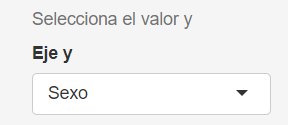

```{r setup, include=FALSE}
knitr::opts_chunk$set(echo = TRUE)
library(shiny)
```

## Introduccion

Este documento de RMarkDown tiene el objetivo de ilustrar con rigurosidad el funcionamiento del Visor de datos usado en este seminario. Para ello, se explicaran como están formadas las diferentes partes de una aplicación Shiny y como estas interactuan entre ellas.

Sin embargo, antes de introducirnos de lleno hay que aclarar unos conceptos claves para comprender una aplicación Shiny.

## Conceptos clave

### UI

La UI o interfaz gráfica es la capa del programa con la que el usuario interactua y está constituida de widgets o elementos gráficos que permiten al usuario seleccionar, introducir, eliminar, accionar... De manera que se confiere interactividad a la aplicación. Estos parámetros que el usuario determina entran dentro de la categoria de INPUT y se podrá acceder a ellos desde el servidor

### Server (Concepto)

El server o servidor es la capa del programa en el que se producen todos los cálculos y procesos de la apliación. Se trata de una función con parámetros de input y de output.

```{r, message = F, warning=FALSE}
server <- function(input,output){
  #Logica del servidor
}
```

### Call

El Call o llamada es la linea de codigo que inicializa la apliación e integra la UI y el SERVER

```{r eval=FALSE, message=TRUE, warning=FALSE}
UI <- fluidPage()
SERVER <- function(input,output){}
shinyApp(ui <- UI, server <- SERVER)
```

### Reactividad

Un proceso o una variable se considera reactiva cuando su valor no es fijo y se puede actualizar en función de los inputs que inserte el usuario.

La reactividad es la base de las aplicaciones shiny y es indispensable su uso para el funcionamiento de la aplicación.

Existen varios tipos de entornos reactivos en shiny, los usados en la aplicación son los siguientes:

-   `reactive({})`

-   `observe({})`

-   Funciones tipo render (e.j `renderImage()`, `renderText()`, `renderUI()`...)

Unicamente dentro de estos entornos reactivos se puede hacer uso de la reactividad de las variables.

### Input

El parametro *input* se trata de una lista que se inserta en la función server como parámetro y nos da la capacidad de acceder a la información que el usuario inserta o determina en la UI.

Para ello se utiliza el operador *\$* seguido del *inputid* (e.j input\$archivoGuardado)

```{r,eval=FALSE, warning=FALSE,message=FALSE}
server <- function(input,output){
  # Lógica del server
  var1 <- input$archivoGuardado #Asignacion de la variable con el operador $
}
```

### Output

El parametro output es una lista que se inserta en la función server como parámetro, en está lista se insertarán los diferentes outputs que se generen en el server para que puedan ser usados posteriormente en la UI o donde se requiera su uso.

Para crear un output se utiliza el operador \$ seguido del outputid (e.j output\$imagen)

```{r, eval = FALSE, message=FALSE}
#Interfaz donde se utliza el output
ui <- fluidPage({ 
  title = "Ejemplo"
  textOutput("texto") #Imprime el texto generado por el output
})
#Servidor donde se genera el output
server <- function(input,output){
  output$texto <- renderText("Texto de ejemplo") #Crea el output con el id texto
}
#Lanza la aplicacion
shinyApp(ui <- ui, server <- server)
```

### Widgets {data-link="widgets"}

#TODO

## Visor de datos-Funcionamiento

El visor de datos tiene como objetivo la visualización interactiva de los datasets que van a ser usados para el seminario. Estos datasets serán exportados como csv (separados por ';') y tienen que estar estructurados por columnas de la siguiente forma:

Sexo-Comunidad Autónoma-Dato Categórico- Total relativo(%)

Para más explicaciones del porque remitirse a la documentación de la función `TratamientoDatosGeneral()` del archivo Funciones.R

### Preambulo

Previo al inicio de la aplicación se ejecuta el siguiente código, el cual es indispensable para el funcionamiento de la misma.

```{r, eval = FALSE}
library(shiny)
library(ggplot2)
source("Input\\Funciones.R")
datasets <- list.files("Input\\data")
claseplot <- c("Boxplot", "Histograma", "Density")
```

En esta pequeña porción del codigo de cargan las librerias shiny y ggplot que se utilizarán durante todo el documento. También se hace `source()` del script que contiene las funciones. Además se cargan dos vectores; El primero, `datasets`, contiene todos los archivos dentro de la carpeta *data* donde, presuntamente, solo debería haber los csv correspondientes a los datasets a representar. El segundo vector, `claseplot`, contiene los tipos de gráfico que se van a poder representar con la aplicación.

### Interfaz Gráfica (UI)

El código que forma la UI del visor de datos es sencillo, pese a su aparente complejidad, en este apartado analizaremos cada uno de los componentes de la UI y que papel juega en el aspecto final de la aplicación.

#### Fluidpage y Layout

La primera materia a considerar en el desarrollo de una UI es la organización o layout en la que se van a disponer los elementos de la interfaz. En este caso el Layout elegido es un `sidebarLayout()` que esta formado por un `mainPanel()` (panel principal) y un `sidebarPanel()`(panel lateral).

Este Layout es un parámetro de la función `fluidpage()`, que es un marco que puede alojar varios tipos de Layouts, siendo uno de ellos el `sidebarLayout()`.

En cada uno de estos campos se van a introducir los distintos widgets y outputs que forman la aplicación.

```{r}
#UI------------------------------
ui <- fluidPage(
  #Titulo de la pagina
  titlePanel(h2("Visor de datos")),
  #Utilizamos un sidebarLayout
  sidebarLayout(
    #El panel lateral izquierdo
    sidebarPanel(
      #Informacion dentro del panel lateral
    ),
    mainPanel(
      #Informacion dentro del panel principal
    )
  )
)
```


#### SidebarPanel

El sidebarPanel o panel lateral de la aplicación alojará todos los [widgets] necesarios para que el usuario modifique y represente la gráfica que quiera. Cada uno de estos [widgets] determinará una variable reactiva que modificará los diferentes outputs (ver esto en la sección de [Server]).

Antes de introducirnos a fondo con el funcionamiento saber que el panel lateral se ha dividido en dos columnas para una mejor organización de los elementos

Se procederá a explicar uno por uno todos los diferentes widgets usados en el sidebarPanel, también se especificará su respectivo código para futura referencia en el documentos.

##### Dataset 1 (SelectInput) {#dataset-1-selectinput}

**INPUTID: dataset1**

[SelectInput](https://shiny.posit.co/r/reference/shiny/latest/selectinput) que permite escoger el primer dataset que se desea representar, las opciones vienen determinadas por el vector `datasets` que contiene todos los documentos de la carpeta `"Input\data"`, la linea que lee los documentos de esta carpeta se encuentra en el [preambulo] (linea 4). El codigo que forma este widget es el siguiente:

```{r,eval = F}
sidebarPanel(
column(6,
        #Se escoge el primer dataset a representar
        helpText(h5("Primer dataset a representar")),
        selectInput("dataset1", "Dataset 1", 
                    choices = datasets),
       #RESTO DE LA COLUMNA
  ),
column(6,
       #Segunda columna del sidebarpanel
       )
  #RESTO DEL SIDEBAR
)
```


##### Dataset 2 (SelectInput)

**INPUTID: dataset2**

[SelectInput](https://shiny.posit.co/r/reference/shiny/latest/selectinput) similar al [Dataset 1 (SelectInput)](#dataset-1-selectinput), permite seleccionar un segundo dataset a representar.

El codigo que forma este widget es el siguiente:

```{r,eval = F}
sidebarPanel(
column(6,
       #Primera columna del sidebarPanel
       ),
column(6,
       #RESTO DE LA COLUMNA
       
        #Se escoge el segundo dataset a representar
        helpText(h5("Primer dataset a representar")),
        selectInput("dataset2", "Dataset 2", 
                    choices = datasets),
       #RESTO DE LA COLUMNA
  )
  #RESTO DEL SIDEBAR
)

```


##### Eje x (SelectInput) {#eje-x-selectinput}

**INPUTID: valuex**

[SelectInput](https://shiny.posit.co/r/reference/shiny/latest/selectinput) que permite escoger la variable a representar en el eje x, las opciones provienen de las columnas que forman los datasets seleccionados. Para actualizar las opciones en función de estos datasets se utiliza la funcion [`updateselectinput()`](https://shiny.posit.co/r/reference/shiny/latest/updateselectinput) en el apartado de [Server] (ver aquí #TODO).

El codigo que forma este widget es el siguiente:

```{r,eval = F}
sidebarPanel(
column(6,
        #Se escoge el valor del eje x
        helpText(h5("Selecciona el valor x")),
        selectInput("valuex", "Eje x", 
                    choices = "N/A"),
       #RESTO DE LA COLUMNA
  ),
column(6,
       #Segunda columna del sidebarpanel
       )
  #RESTO DEL SIDEBAR
)
```


##### Eje y (SelectInput)

**INPUTID: valuey**

[SelectInput](https://shiny.posit.co/r/reference/shiny/latest/selectinput) similar al [Eje x (SelectInput)](#eje-x-selectinput), permite escoger la variable a representar en el eje y.

El codigo que forma este widget es el siguiente:

```{r, eval = F}
sidebarPanel(
column(6,
          #Primera columna del sidebarPanel
       ),
column(6,
       #RESTO DE LA COLUMNA
       
        #Se escoge el valor a representar en el eje y
        helpText(h5("Selecciona el valor y")),
        selectInput("valuey", "Eje y", 
                    choices = "N/A"),
       #RESTO DE LA COLUMNA
  )
  #RESTO DEL SIDEBAR
)
```



##### Tipo de gráfico (SelectInput)

**INPUTID: claseplot**

[SelectInput](https://shiny.posit.co/r/reference/shiny/latest/selectinput) que permite escoger la clase de gráfico que se quiere representar, las opciones vienen dadas por el vector `claseplot` cuyos valores se determinan en el [preambulo] (linea 5).

El código que forma este widget es el siguiente:

```{r,eval = F}
sidebarPanel(
column(6,
        #RESTO DE LA COLUMNA
       
        #Se escoge el gráfico a representar
        helpText(h5("Permite seleccionar el tipo de gráfico a representar")),
        selectInput("claseplot", "Tipo de gráfico",
                    choices = claseplot)

  ),
column(6,
       #Segunda columna del sidebarpanel
       )
)
```


##### Sexo a Representar (SelectInput)

**INPUTID: sexorepresentar**

[SelectInput](https://shiny.posit.co/r/reference/shiny/latest/selectinput) que permite escoger el sexo que se quiere representar, las opciones vienen dadas por el vector descrito en el código, que contiene una opción para cada sexo, otra para Hombres y Mujeres y otra si no se quiere hacer ningún filtrado.

El código que forma este widget es el siguiente:

```{r,eval = F}
sidebarPanel(
column(6,
       #Primera columna del sidebarPanel
       ),
column(6,
       #RESTO DE LA COLUMNA
        #Se escoge el sexo que se quiere representar en los datos
        helpText(h5("Elige el Sexo a representar")),
        selectInput("sexorepresentar", "Sexo a Representar",
                    choices = c("N/A","Hombres","Mujeres","Ambos sexos", "Hombres/Mujeres"))
       #RESTO DE LA COLUMNA
  )
  #RESTO DEL SIDEBAR
)

```


##### Panel condicional Boxplot

El panel condicional es una estructura que se muestra en la interfaz si se cumple cierta condición, en este caso, el panel se mostrará si el input elegido en el widget [Tipo de gráfico (SelectInput)] es `Boxplot`.

Este panel contendrá los widgets que seleccionen variables que sean relevantes solamente a los [Boxplots](https://es.wikipedia.org/wiki/Diagrama_de_caja), evitando así la aparición de elementos inútiles en la interfaz.

El código que forma este widget es el siguiente:

```{r,eval = F}
sidebarPanel(
  column(6,
         #Primera columna del sidebarPanel
         ),
  column(6,
         #Segunda columna del sidebarPanel
    ),
  conditionalPanel("input.claseplot == 'Boxplot'", #Condición dada por claseplot
      #WIDGETS DEL PANEL CONDICIONAL
  )
)
```

###### Elemeto mapping (Radiobuttons)

**INPUTID: elementomappingB**

[Radiobuttons](https://shiny.posit.co/r/reference/shiny/latest/radiobuttons) que permiten escoger el elemento en el que se va a hacer el [Mapping] dentro del boxplot. Este widget está dentro del panel condicional del boxplot, ya que solo afecta a este tipo de gráficos.

Las opciones vienen dadas por el vector indicado en el código, que contiene `jitter`, `Box` y N/A, estas opciones harán el mapeado en [Geom_Jitter] y [Geom_Boxplot] respectivamente.

El código que forma este widget es el siguiente:

```{r,eval = F}
sidebarPanel(
  column(6,
         #Primera columna del sidebarPanel
         ),
  column(6,
         #Segunda columna del sidebarPanel
    ),
  conditionalPanel("input.claseplot == 'Boxplot'", #Condición dada por claseplot
      #Se escoge el elemento en el que se va a hacer el mapping
      helpText(h5("Cambia el color de los elementos del gráfico en funcion de otra       variable")),
      radioButtons("elementomappingB", "Elemento que hace el mapping",
                    choices = c("Jitter", "Box", "N/A"))
  )
)

```


##### Panel condicional Histograma

El panel condicional es una estructura que se muestra en la interfaz si se cumple cierta condición, en este caso, el panel se mostrará si el input elegido en el widget [Tipo de gráfico (SelectInput)] es `Histograma`.

Este panel contendrá los widgets que seleccionen variables que sean relevantes solamente a los Histogramas, evitando así la aparición de elementos inútiles en la interfaz.

El código que forma este widget es el siguiente:

```{r,eval = F}
sidebarPanel(
  column(6,
         #Primera columna del sidebarPanel
         ),
  column(6,
         #Segunda columna del sidebarPanel
    ),
 conditionalPanel("input.claseplot == 'Histograma'", #Condición dada por claseplot
      #WIDGETS DEL PANEL CONDICIONAL
  )
)
```

###### Ancho de banda (sliderInput)

**INPUTID: binwidth**

[SliderInput](https://shiny.posit.co/r/reference/shiny/latest/sliderinput) que permite escoger el ancho de las bandas del histograma, el slider permite esccoger un valor entre 1 y 30 y tiene un valor inicial de 5.

El ancho de las bandas del histograma representa el rango de datos que recoge cada una de ellas, un valor menor da mayor número de bandas más pequeñas, un valor mayor da menor número de bandas más grandes, sin embargo, a mayor número de bandas se complica la visualización de todas ellas.

El código que forma este widget es el siguiente:

```{r,eval = F}
sidebarPanel(
  column(6,
         #Primera columna del sidebarPanel
         ),
  column(6,
         #Segunda columna del sidebarPanel
    ),
 conditionalPanel("input.claseplot == 'Histograma'", #Condición dada por claseplot
      #Slider que modifica el ancho de las bandas
      helpText(h5("Cambia el ancho de las bandas")),
      sliderInput("binwidth", "Ancho de banda", min = 1, max = 30, value = 5),
  )
)
```


##### Panel condicional Density Chart

El panel condicional es una estructura que se muestra en la interfaz si se cumple cierta condición, en este caso, el panel se mostrará si el input elegido en el widget [Tipo de gráfico (SelectInput)] es `Density`.

Este panel contendrá los widgets que seleccionen variables que sean relevantes solamente a las density charts, evitando así la aparición de elementos inútiles en la interfaz.

El código que forma este widget es el siguiente:

```{r,eval = F}
sidebarPanel(
  column(6,
         #Primera columna del sidebarPanel
         ),
  column(6,
         #Segunda columna del sidebarPanel
    ),
 conditionalPanel("input.claseplot == 'Density'", #Condición dada por claseplot
      #WIDGETS DEL PANEL CONDICIONAL
  )
)
```

###### Posición (SelectInput)

**INPUTID: densityposition**

[SelectInput](https://shiny.posit.co/r/reference/shiny/latest/selectinput) que permite escoger la colocación respectiva de las areas que forman la density chart. Las posiciones disponibles en el vector de opciones son `stack`, `fill` y `dodge`. Para más información sobre el cada una de las opciones ver [aquí](https://ggplot2.tidyverse.org/reference/geom_density.html).

El código que forma este widget es el siguiente:

```{r,eval = F}
sidebarPanel(
  column(6,
         #Primera columna del sidebarPanel
         ),
  column(6,
         #Segunda columna del sidebarPanel
    ),
 conditionalPanel("input.claseplot == 'Density'", #Condición dada por claseplot
  helpText("Modifica la posicion de las areas de densidad respecto a las   demás"),
  selectInput("densityposition","Posicion", choices = c("stack", "fill", "dodge"))
  )
)

```


##### Variable para mapear

**INPUTID: variablemapping**

[SelectInput](https://shiny.posit.co/r/reference/shiny/latest/selectinput) que permite escoger la variable con la que se hace el [mapping]. Las opciones se obtendrán de las columnas que formen los datasets que se esten representando, por lo tanto las opciones se irán actualizando con la función [`updateselectinput()`](https://shiny.posit.co/r/reference/shiny/latest/updateselectinput) en el apartado de [Server] (ver aquí #TODO).

El código que forma este widget es el siguiente:

```{r, eval = F}
sidebarPanel(
  column(6,
         #Primera columna del sidebarPanel
         ),
  column(6,
         #Segunda columna del sidebarPanel
    ),
      #PANELES CONDICIONALES
      #--------
      #--------
  #Escoge la variable con la que se quiere hacer el mapping
  selectInput("variablemapping","Variable con la que se quiere hacer mapping", 
                  choices = "N/A")
)
```


#### Mainpanel

El mainPanel o panel principal alojará todos los outputs generados por el server como la gráfica, el resumen del dataset, el propio dataset, etc. Para la mejor visualización de la información proveniente de los outputs se organizará el panel principal en tabs o ventanas, cada una de ellas contendrá un output distinto. Para ver más sobre tabs en shiny ver [aquí](https://shiny.posit.co/r/getstarted/build-an-app/customizing-ui/tabs.html)

### Server {data-link="Server"}

#TODO

### Apariencia Global

#TODO (HACER UN GIF)

```{r, eval = F}
#UI------------------------------
ui <- fluidPage(
  #Titulo de la pagina
  titlePanel(h2("Visor de datos")),
  #Utilizamos un sidebarLayout
  sidebarLayout(
    #El panel lateral izquierdo
    sidebarPanel(
      #Se divide el panel en dos columnas
      column(6,
        #Se escoge el primer dataset a representar
        helpText(h5("Primer dataset a representar")),
        selectInput("dataset1", "Dataset 1", 
                    choices = datasets),
        #Se escoge el valor del eje x
        helpText(h5("Selecciona el valor x")),
        selectInput("valuex", "Eje x", 
                    choices = "N/A"),
        #Se escoge el gráfico a representar
        helpText(h5("Permite seleccionar el tipo de gráfico a representar")),
        selectInput("claseplot", "Tipo de gráfico",
                    choices = claseplot)
        
      ),
      #Segunda columna
      column(6,
        #Se escoge el segundo dataset a representar
        helpText(h5("Segundo dataset a representar")),
        selectInput("dataset2", "Dataset 2", 
                    choices = datasets),
        #Se escoge el valor a representar en el eje y
        helpText(h5("Selecciona el valor y")),
        selectInput("valuey", "Eje y", 
                    choices = "N/A"),
        v
      ),
      conditionalPanel("input.claseplot == 'Boxplot'",
                      #Se escoge el elemento en el que se va a hacer el mapping
                      helpText(h5("Cambia el color de los elementos del gráfico en funcion de otra variable")),
                      radioButtons("elementomappingB", "Elemento que hace el mapping",
                                   choices = c("Jitter", "Box", "N/A"))
      ),
      #Panel condicional que se muestra si el gráfico a representar es un histograma
      conditionalPanel("input.claseplot == 'Histograma'",
                       #Slider que modifica el ancho de las bandas
                       helpText(h5("Cambia el ancho de las bandas")),
                       sliderInput("binwidth", "Ancho de banda", min = 1, max = 30, value = 5),
                       helpText(h5("Cambia el color del fill del histograma en función de una variable"))
      ),
      #Panel condicional que aparece si el gráfico a representar es un density chart
      conditionalPanel("input.claseplot == 'Density'",
                       helpText("Modifica la posicion de las areas de densidad respecto a las demás"),
                       selectInput("densityposition","Posicion", choices = c("stack", "fill", "dodge"))
                       ),
      #Escoge la variable con la que se quiere hacer el mapping
      selectInput("variablemapping","Variable con la que se quiere hacer mapping", 
                  choices = "N/A")
      
    ),
    #Panel principal donde se inprime el gráfico
    mainPanel(
      #Barra de navegación para acceder a los distintos elementos
      navbarPage(
        title = strong("VISTA"),
        #Panel donde se observa el plot
        tabPanel(title = "Plot",
                 plotOutput("plot"),
                 column(width = 6, selectizeInput("viewop","Opciones de Vista",
                                                 choices = list("Simplificar eje x" = "simpx",
                                                                "Simplificar eje y" = "simpy"),
                                                 multiple = T)),
                 column(width = 6, helpText("Guarda el gráfico en la carpeta de OutputPlot
                                            Para ver el display de las gráficas ir al tab 'Guardados'")
                        , actionButton("save", "Guardar Grafico",),
                        textInput("filename", "Nombre del archivo", value = "plot 0")),
        ),
        #Panel donde se ve el resumen
        tabPanel(title = "Resumen",  verbatimTextOutput("resumen")),
        #Panel donde se ven los datos
        tabPanel(title = "Data", tableOutput("tablajoin")),
        #Panel donde se ve la relacion entre los niveles y sus respectivos numeros
        # una vez hecha la simplificación de los ejes
        tabPanel(title = "Levels", h3("Leyenda de simplificacion eje x"),
                 verbatimTextOutput("summaryx"),
                 h3("Leyenda de simplificacion eje y"),
                 verbatimTextOutput("summaryy")),
        tabPanel(title = "Guardados",uiOutput("imagenes"))
      )
    )
  )
)
```

## Conceptos de interes

### Mapping {data-link="Mapping"}

#TODO

### Geom_density

### Geom_histogram

### Geom_Jitter {data-link="Geom_Jitter"}

### Geom_Boxplot {data-link="Geom_Boxplot"}
